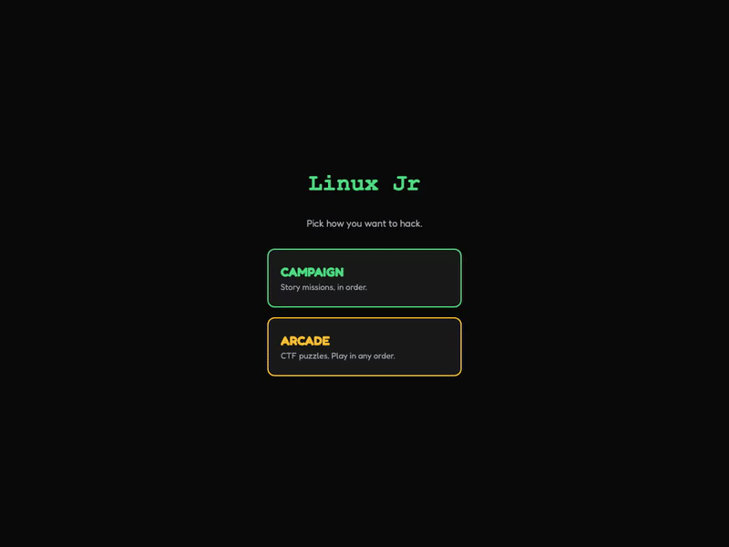

# Linux Jr

> **A browser-based Linux terminal for kids.** Teaches real commands through missions, not lessons — so when they grow up and open Terminal.app, the muscle memory is already there.

**Live demo:** https://linux-jr.vercel.app &nbsp;·&nbsp; **CLI:** `npx linuxjr` &nbsp;·&nbsp; [SOUL.md](./SOUL.md) &nbsp;·&nbsp; [Knowledge base](./kb/wiki/index.md)

<!-- TODO: hero GIF of M1 gameplay at 600px wide -->
<!--  -->

---

## What this is

A web app where a kid opens a URL and gets a terminal. Green text on dark background. Blinking cursor. Missions that feel like hacking. The kid types **real Linux commands** (`pwd`, `ls`, `cd`, `cat`, `mkdir`) to find hidden files, decode messages, and help a cast of friends in a cozy tinker-workshop.

No Linux under the hood — it's a virtual filesystem in JavaScript with kid-friendly error messages and TTS narration. Works on iPad Safari in standalone PWA mode. Age 7+.

Also shippable as a real shell app: **`npx linuxjr`** runs the same game in your actual terminal.

## Why I built it

Most kid-coding tools use pretend languages — Scratch blocks, drag-and-drop widgets, fake robot DSLs. They teach logic. They don't build muscle memory for the tools a professional uses. A kid who spends three years on Scratch still opens a real terminal at age 12 and sees gibberish.

Linux Jr flips that. Every command the kid types is **the same command** running on every server, Raspberry Pi, and Mac shell on Earth. By the end of Season 1 they've typed `ls` hundreds of times. They graduate to a real shell and there's nothing to unlearn.

## Try it

### Web
```bash
# just go to the live site
open https://linux-jr.vercel.app
```

### Terminal (real shell)
```bash
npx linuxjr
```

### Local dev
```bash
bun install
bun run dev      # http://localhost:5200
bun run build    # production build
bun run lint     # clean (0 errors, 0 warnings)
```

## Two things this project is actually about

Besides being a playable game, Linux Jr is two design experiments I care about:

### 1. A soul doc that actually gets enforced ([`SOUL.md`](./SOUL.md))

Most projects have a `README` and a `CLAUDE.md` — "how to work." Very few have a "what cannot bend" doc that every PR is checked against. `SOUL.md` captures the non-negotiables: *the terminal IS the whole product*, *real Linux not pretend Linux*, *typing is mandatory*, *nothing fails scary*, plus a strict hierarchy (commands > ethos > pedagogy > narrative) for settling trade-offs when decisions conflict.

The reason this exists: one of my own iterations tried to build a "6-beat mission shape" with modal cards for mission briefings and post-mission callbacks. It violated `SOUL.md #1` (the terminal IS the whole product). I caught it, walked it back, and [committed the rejection as a tombstone](https://github.com/nalediym/linux-jr/tree/engine/terminal-extension) so future sessions don't re-propose the same mistake.

### 2. An LLM-compiled world bible ([`kb/`](./kb/wiki/index.md))

The world — Pip the kid inventor, Captain Rex the mentor, Sprocket the half-built robot cat, the Workshop setting, the 10-mission arc — lives in a scratchpad outside this repo. A compile step (via the `/knowledge-base` skill) ingests the bible + the mission files + `CLAUDE.md` and produces a queryable markdown wiki at `kb/wiki/`: **27 concept pages** (characters, locations, commands, arcs, style rules), **99 chunks**, zero lint errors, content-addressed citations.

When I draft a new mission I can ask *"has Pip met Captain Rex on-page yet?"* or *"what props are already in the toolbox?"* and get cited answers. It's an experiment in keeping world canon consistent across dozens of missions without holding it all in my head.

## Architecture

```
src/
  components/
    Terminal.jsx       Main UI — custom input bar (not raw xterm.js), iPad-friendly
    FileSystem.js      In-memory virtual filesystem — dirs are objects, files are strings
    CommandParser.js   Switch on command name — pwd, ls, cd, cat, mkdir, help
    MissionEngine.js   Typed task checks (pwd_equals, command_used, output_contains, file_read)
  data/
    missions/          One file per mission — filesystem tree + task sequence + story
  hooks/
    useVoice.js        ElevenLabs MP3 with speechSynthesis fallback
    useTerminalSounds  Procedural Web Audio beeps + barks
    useTelemetry.js    localStorage play log (for later adaptive hints)

cli/                   Ink-based CLI workspace — npx linuxjr
kb/                    Compiled knowledge base (queryable world canon)
SOUL.md                The non-negotiables
CLAUDE.md              How to work in this repo
```

No router. Single-page app. The terminal *is* the whole product.

## The missions

| # | Title | Teaches | Concept |
|---|---|---|---|
| 1 | The Missing Blueprint | `pwd`, `ls`, `cd`, `cat`, dotfiles | location — "everything lives somewhere" |
| 2 | The Secret Code | nested `cd`, `cat` across deeper trees | decomposition — break a 4-digit problem into four 1-digit ones |
| 3 | The Maze | `cd ..`, deep navigation, dotfiles | sequencing — step-by-step instructions |

Missions 4–10 are drafted in the bible and waiting on a prerequisite: `touch` / `echo` / `man` need to be added to `CommandParser.js` before Act 2.

Each mission has a rated Cyberchase-inspired shape — hook, brief, concept intro, play, real-world callback, ethos reflection — but all of it lives as terminal output. No modal cards. See `SOUL.md` for why.

## Commands currently wired up

| Command | What it does | Kid framing |
|---|---|---|
| `pwd` | print working directory | "Where am I?" |
| `ls` | list files | "What's in here?" |
| `cd` | change directory | "Go to..." |
| `cd ..` | parent directory | "Go back" |
| `cat` | read file | "Read this..." |
| `mkdir` | make directory | "Build a room" |
| `help` | list available commands | "What can I do?" |

Also: Tab completion, `clear`, command history.

## Stack

- **React 19 + Vite 8** — no component library, tiny bundle (68 kB gzipped)
- **Fredoka** font (UI) + system monospace (terminal)
- **Web Audio API** for procedural sounds
- **Browser speechSynthesis** for TTS, with ElevenLabs MP3 override
- **localStorage** for progress, autosave, telemetry
- **Bun** workspace for the web app + the CLI
- **Ink** for the `npx linuxjr` terminal experience
- **Vercel** deploy on push to `main`

## What's deliberately not here

Documented in `SOUL.md`. Quick highlights:
- No analytics or tracking
- No test framework — small enough that typed task checks + playthroughs + manual iPad QA are the verification story
- No click-to-execute buttons — the kid **types**, no shortcuts
- No red error styling, no "wrong", no failure states
- No villains, no scary, no time pressure
- No jargon a 7-year-old wouldn't know (`shell`, `kernel`, `stdin`, `permission` — all deferred)

## Contributing

Every PR to `main` runs:
- `bun run lint` — ESLint 9 flat config, zero-tolerance
- `bun run build` — Vite production build
- `bun run guard` — **the Sloppy Guard** (`scripts/sloppy-guard.sh`), a battery of checks that enforce SOUL.md rules: no debug statements left in, required files present, README integrity, banned words in user copy, orphan TODOs, and more
- `gitleaks` secrets scan across the diff

Run `bun run guard` locally before `git push` — same checks CI runs, same output format. The guard grows over time: every new class of sloppiness gets a check.

## Credits

- **Game design + writing + code:** Naledi ([@nalediym](https://github.com/nalediym))
- **Pair-programmed with Claude Code** — session logs are in the git history as real PRs with real reviews, not squash-commits
- **Inspiration:** *Bluey* for tone (previously used directly as placeholder characters, swapped out for original cast; see PR #2 for the reframe). *Cyberchase* (PBS) for the pedagogical shape. *Daniel Tiger* for the Nick Jr. register. Kali Linux for aesthetic direction on the rejected engine-extension exploration.

## License

[MIT](./LICENSE). Fork it, remix it, build your own. If you ship a variant, please don't reuse the M2 "Captain Rex forgot his own password" framing without crediting — the ethical-hacker reframe was the whole point of that mission.

---

*Built as a love letter to every kid who sees a terminal and thinks "I want to do that." The faster you graduate to a real shell, the faster the world opens up.*
